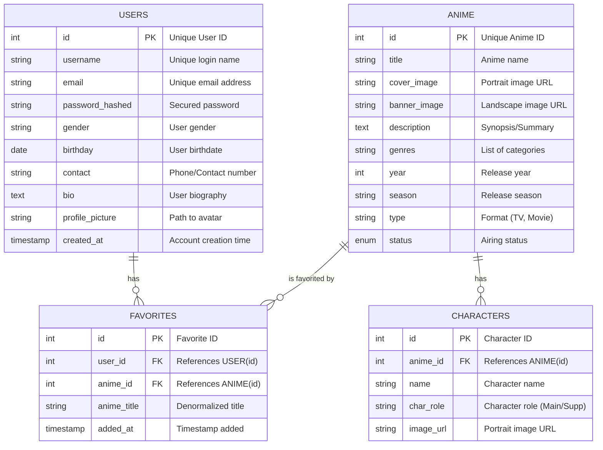

# AniCrave Database ERD

This document provides a visual representation of the AniCrave database structure and the relationships between its tables.

## Entity Relationship Diagram

## Relationship Details

### 1. Users (USER) to Favorites

- **Type**: One-to-Many (`1:N`)
- **Description**: A single user can have multiple entries in the favorites table.
- **Constraint**: `favorites.user_id` references `user.id`.

### 2. Anime to Favorites

- **Type**: One-to-Many (`1:N`)
- **Description**: A single anime can appear in many users' favorite lists.
- **Constraint**: `favorites.anime_id` references `anime.id`.

### 3. Anime to Characters

- **Type**: One-to-Many (`1:N`)
- **Description**: Each anime series has a collection of characters associated with it.
- **Constraint**: `characters.anime_id` references `anime.id`.

---

> [!TIP]
> This diagram uses the **Mermaid** syntax. You can view it rendered in VS Code, GitHub, or any Mermaid-compatible markdown viewer.
